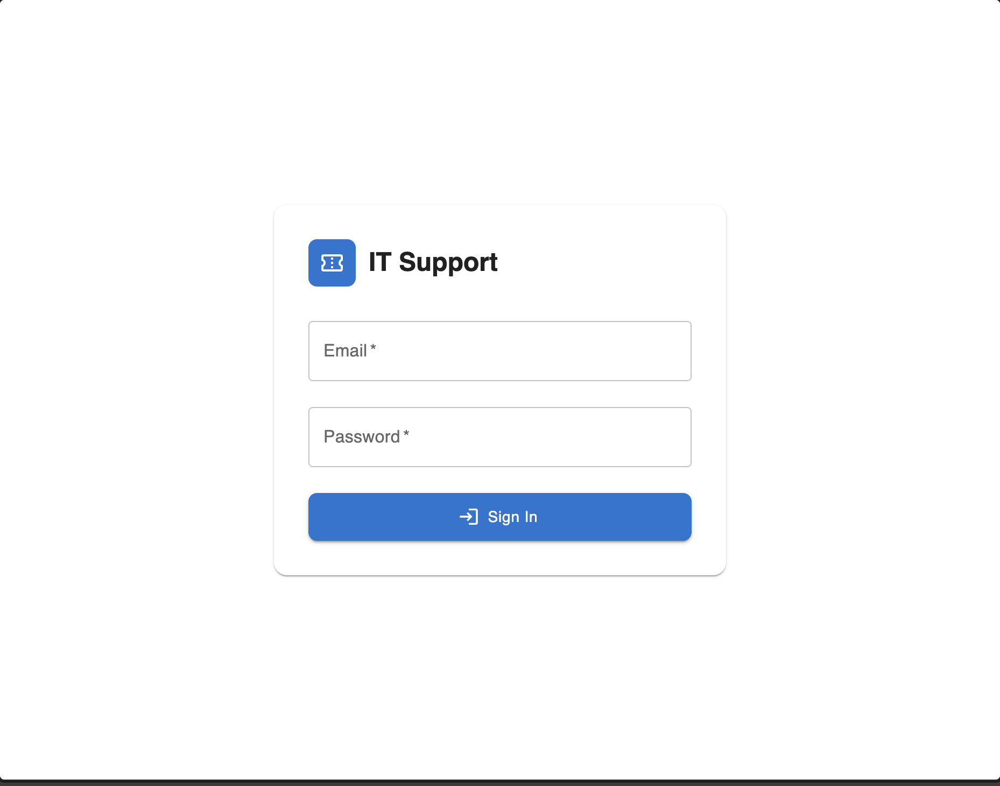
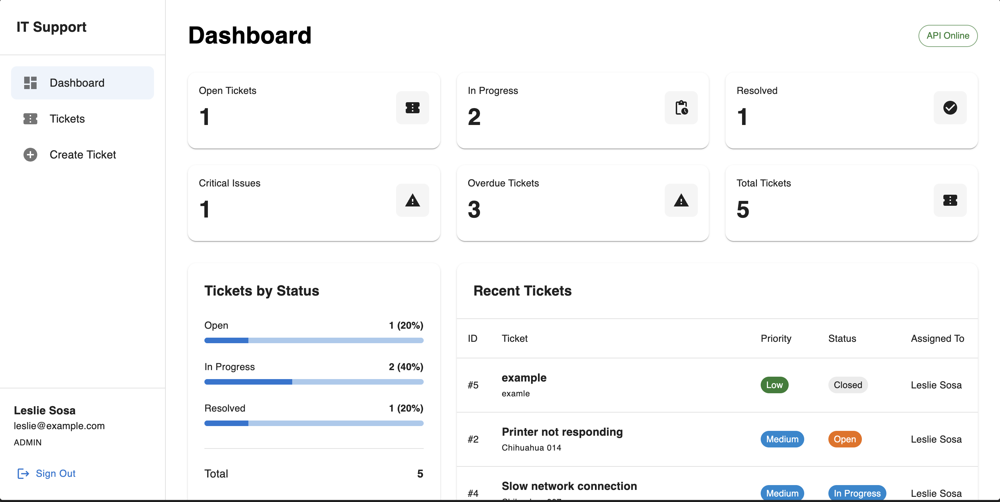
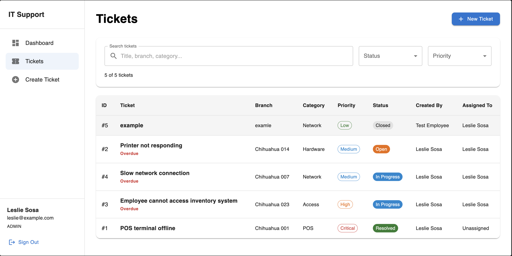
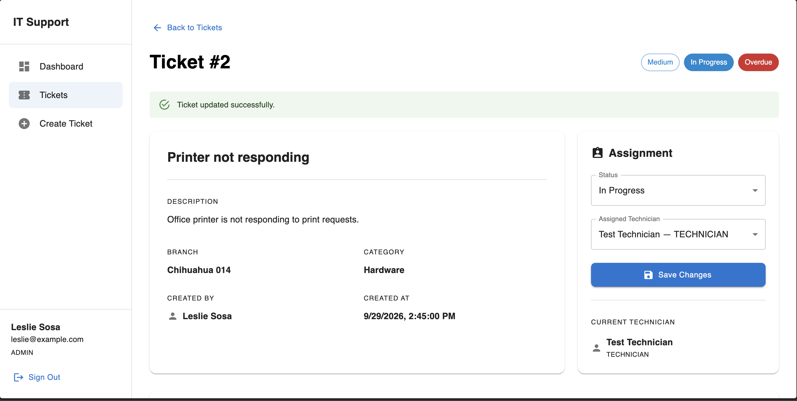
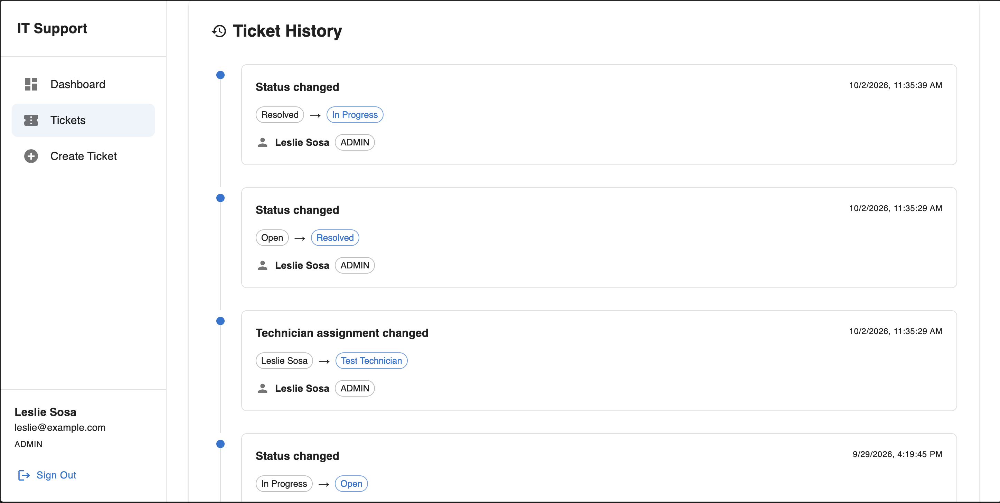
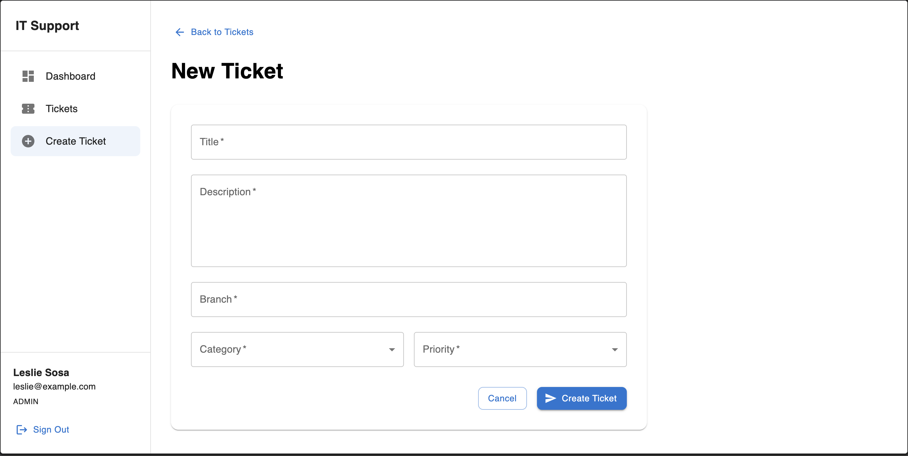
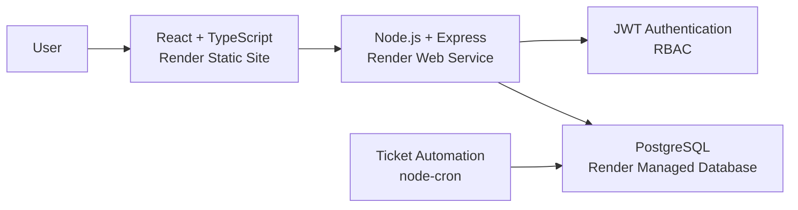

# IT Support Management Dashboard

A full-stack IT support ticket management system designed to simulate an internal help desk environment.

The application allows employees to report technical issues, while administrators and technicians can manage, assign, track and resolve support tickets.

## Live Demo

The application is deployed on Render.

- **Frontend:** [IT Support Management Dashboard](https://it-support-management-dashboard.onrender.com)
- **Backend API:** [IT Support API](https://it-support-api-znph.onrender.com)
- **API Health Check:** [Check API Status](https://it-support-api-znph.onrender.com/api/health)

## Features

- JWT-based authentication
- Role-based access control
- Ticket creation and management
- Technician assignment
- Ticket status tracking
- Priority and category management
- Ticket audit history
- Automatic overdue ticket detection
- Dashboard statistics
- Search and filtering
- Responsive interface
- PostgreSQL relational database
- Request validation with Zod
- Automated backend tests
- Continuous Integration with GitHub Actions
- Full Docker support
- Production deployment with Render

## User Roles

### Employee

Employees can:

- Create support tickets
- View their own tickets
- View ticket details
- View ticket history

### Technician

Technicians can:

- View all tickets
- Change ticket status
- Assign tickets to technicians
- View ticket history
- Access dashboard statistics

### Administrator

Administrators have access to all ticket management functionality, including:

- Viewing all tickets
- Updating ticket status
- Assigning technicians
- Viewing audit history
- Accessing global dashboard statistics

## Tech Stack

### Frontend

- React
- TypeScript
- Vite
- Material UI
- React Router

### Backend

- Node.js
- Express
- TypeScript
- Zod
- JSON Web Tokens
- bcryptjs
- node-cron

### Database

- PostgreSQL
- `pg`

### Testing

- Vitest
- Supertest

### DevOps

- Docker
- Docker Compose
- Nginx
- GitHub Actions
- Render

## Screenshots

### Login



### Dashboard



### Tickets



### Ticket Detail



### Ticket History



### Create Ticket



## Production Architecture



## Project Structure

```text
it-support-management-dashboard/
├── .github/
│   └── workflows/
│       └── ci.yml
│
├── docs/
│   └── screenshots/
│
├── server/
│   ├── sql/
│   ├── src/
│   │   ├── config/
│   │   ├── controllers/
│   │   ├── middleware/
│   │   ├── routes/
│   │   ├── schemas/
│   │   ├── services/
│   │   └── types/
│   │
│   ├── tests/
│   ├── Dockerfile
│   └── package.json
│
├── src/
│   ├── components/
│   ├── config/
│   ├── context/
│   ├── pages/
│   ├── services/
│   └── types/
│
├── Dockerfile
├── docker-compose.yml
├── nginx.conf
├── package.json
└── README.md
```

## Ticket Workflow

Tickets can use the following statuses:

```text
Open
In Progress
Resolved
Closed
```

Available priorities:

```text
Low
Medium
High
Critical
```

Available categories:

```text
Network
Hardware
Software
POS
Access
Other
```

## Ticket History

Changes made to a ticket are stored in an audit history.

The system records changes such as:

- Status changes
- Technician assignments
- Previous value
- New value
- User who made the change
- Date and time of the change

This provides traceability for ticket activity.

## Overdue Ticket Automation

The backend includes an automated process using `node-cron`.

Tickets with the following statuses:

```text
Open
In Progress
```

are automatically marked as overdue when they have been open for more than 24 hours.

## Authentication and Authorization

Authentication uses JSON Web Tokens.

After login, the backend generates a JWT containing the authenticated user's:

- User ID
- Email
- Role

Protected API endpoints require:

```http
Authorization: Bearer <token>
```

JWT expiration is configured through the environment variable:

```env
JWT_EXPIRES_IN=8h
```

Role-based authorization is enforced on the backend.

Sensitive ticket management operations are restricted to:

```text
ADMIN
TECHNICIAN
```

Employees can only access tickets associated with their own account.

## Validation

API request bodies are validated with Zod.

Validation is applied to:

- Login
- Registration
- Ticket creation
- Ticket updates

Invalid requests return structured validation errors before reaching the controller logic.

## Database

PostgreSQL is used as the relational database.

Main entities include:

```text
users
tickets
ticket_history
```

Relations are used to track:

- Ticket creator
- Assigned technician
- User responsible for ticket history changes

## Database Initialization

SQL initialization files are stored in:

```text
server/sql/
```

They are executed in order:

```text
001_init.sql
002_auth.sql
003_ticket_user_relations.sql
004_ticket_history_user.sql
```

For the local Docker environment, the SQL directory is mounted into:

```text
/docker-entrypoint-initdb.d
```

When PostgreSQL creates a new Docker volume, the schema is initialized automatically.

For a managed PostgreSQL deployment, such as Render PostgreSQL, the SQL files must be executed against the database during its initial setup.

## Environment Variables

### Frontend

Create:

```text
.env.local
```

using:

```env
VITE_API_URL=http://localhost:3000/api
```

An example is available in:

```text
.env.example
```

For production, `VITE_API_URL` points to the deployed backend API.

### Backend

Create:

```text
server/.env
```

using `server/.env.example` as a reference:

```env
PORT=3000

DB_HOST=localhost
DB_PORT=5433
DB_NAME=it_support_db
DB_USER=it_support_user
DB_PASSWORD=your_database_password

JWT_SECRET=your_jwt_secret
JWT_EXPIRES_IN=8h

FRONTEND_URL=http://localhost:5173
```

Never commit real database credentials, passwords or JWT secrets.

## Running with Docker

Make sure Docker Desktop is running.

Create the backend environment file:

```bash
cp server/.env.example server/.env
```

Update the values in `server/.env` if necessary.

Then run:

```bash
docker compose up --build
```

The services will be available at:

```text
Frontend:   http://localhost:8080
Backend:    http://localhost:3000
PostgreSQL: localhost:5433
```

To stop the containers:

```bash
docker compose down
```

The PostgreSQL volume is preserved.

> `docker compose down -v` also removes the database volume and its stored data.

## Running in Development Mode

### 1. Start PostgreSQL

From the project root:

```bash
docker compose up -d postgres
```

### 2. Start the Backend

```bash
cd server
npm install
npm run dev
```

Backend:

```text
http://localhost:3000
```

### 3. Start the Frontend

Open another terminal from the project root:

```bash
npm install
npm run dev
```

Frontend:

```text
http://localhost:5173
```

## API Health Check

The API exposes a health endpoint:

```http
GET /api/health
```

Local:

```bash
curl http://localhost:3000/api/health
```

Production:

```text
https://it-support-api-znph.onrender.com/api/health
```

A successful response confirms that both the API and PostgreSQL connection are available.

## Testing

Backend tests use Vitest and Supertest.

Run:

```bash
cd server
npm test
```

The test suite covers areas including:

- API availability
- Authentication protection
- JWT validation
- Authorization
- Role restrictions
- Ticket validation
- Authentication security

Watch mode is also available:

```bash
npm run test:watch
```

## Lint and Build

### Frontend

```bash
npm run lint
npm run build
```

### Backend

```bash
cd server
npm run build
```

## Continuous Integration

GitHub Actions automatically validates the project on pull requests and pushes to `main`.

The CI workflow runs:

### Frontend

```text
npm ci
npm run lint
npm run build
```

### Backend

```text
npm ci
npm test
npm run build
```

This helps prevent broken code from being merged into the main branch.

## Deployment

The production environment is hosted on Render.

### Frontend

The React application is deployed as a Render Static Site:

```text
https://it-support-management-dashboard.onrender.com
```

The frontend uses the production environment variable:

```env
VITE_API_URL=https://it-support-api-znph.onrender.com/api
```

A rewrite rule sends application routes to:

```text
/index.html
```

allowing React Router routes to work correctly when a page is refreshed.

### Backend

The Express API is deployed as a Render Web Service:

```text
https://it-support-api-znph.onrender.com
```

Production database credentials, JWT configuration and the allowed frontend origin are provided through Render environment variables.

### Database

The production database uses managed PostgreSQL on Render.

The backend connects to PostgreSQL using Render's internal network rather than exposing the database connection to the frontend.

## Security

The project includes several security measures:

- Password hashing with bcrypt
- JWT authentication
- JWT expiration
- Protected API routes
- Role-based authorization
- Input validation with Zod
- Environment-based secrets
- Restricted CORS configuration
- Restricted ticket access for employees
- Database credentials isolated from the frontend
- Generic authentication errors for invalid credentials

Passwords, database credentials and JWT secrets are not stored in the repository.

## Future Improvements

Possible future additions include:

- Email notifications
- Ticket comments
- File attachments
- User management interface
- Advanced reporting
- Service-level agreements
- Password reset
- Refresh tokens
- Automated database migrations
- Expanded integration testing

## Author

**Leslie Sosa**

Information Technology and Telecommunications Engineering student.

GitHub: [LeslieSc](https://github.com/LeslieSc)

## License

This project was created for educational and portfolio purposes.